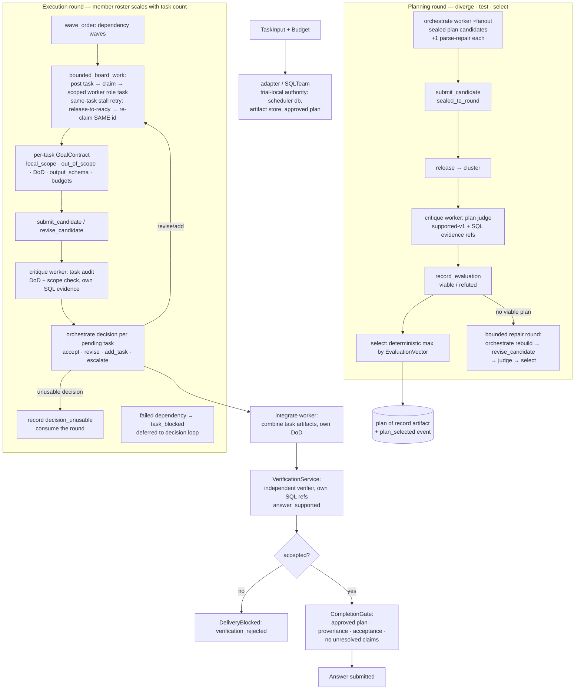

# hybrid_v2 architecture

LLM-orchestrated decomposition inside the board-claim swarm. The orchestrator reads
the task, submits a plan, and creates tasks filled according to the approved plan;
workers execute small, well-defined scopes; critiques and a bounded decision loop
provide the feedback. Centralized intent and termination, decentralized exploration:
LLM proposes, deterministic machinery validates, selects, sequences, and gates.

## Components and responsibilities

| Component | Location | Responsibility | Who decides |
|---|---|---|---|
| **Planner** (`orchestrate` role) | `SQLTeam.hybrid_v2()` | Decomposes the objective into 2–8 `PlannedTask`s (objective, local_scope, out_of_scope, DoD, dependencies); fan-out ×2–3 sealed | LLM proposes |
| **Plan judge** (`critique` role) | same | Audits the decomposition (coverage, scope sharpness, acyclic deps, checkable DoD) with own SQL evidence; must cite exact `evidence_ref`s | LLM critiques |
| **Deterministic selection** | `CollaborationController.select()` | Picks the max-scoring viable plan — plans are data, never authority | Code |
| **Hard plan validation** | `poc/hybrid/planning.py` | 2–8 tasks, non-empty scope + ≥1 DoD, unique ids, acyclic dependencies, decision refs — one bounded repair, then branch-fail | Code |
| **Scoped task workers** (`task` role) | wave loop | Execute exactly one task under a GoalContract; read-only SQL; artifact contract on output | LLM works |
| **Task auditor** (`critique` role) | `critique_pass` | Checks output against its own DoD/scope; flags scope creep | LLM audits |
| **Orchestrator decision loop** (`orchestrate`) | ≤ `hybrid_max_decision_rounds` | Per pending task: accept / revise / add_task / escalate; unusable decisions consume the round | LLM decides, code validates |
| **Board + scheduler** | `BoardClaimStrategy` + `bounded_board_work` | Durable claims, leases, dependency blocking; one same-task retry (release-to-ready → re-claim same id) keeps dependency wiring valid | Code |
| **Integration** (`integrate` role) | end of flow | Combines accepted task artifacts into the final Answer under the plan's integration DoD | LLM |
| **Independent verifier** | `VerificationService` | Separate worker verifies the integrated answer with own SQL evidence | LLM verifies |
| **Completion gate** | `CompletionGate` | Deterministic: plan approved, provenance present, artifacts accepted, no unresolved claims | Code |
| **Memory split** | ArtifactStore + Blackboard + SQLite | High-fidelity artifacts (sealed → released), compact evidence claims, durable rounds/candidates/tasks/attempts/events | — |
| **Budget model** | `ROLE_POOLS` / `hybrid_pool_weights` | Per-role pools (orchestrate .24 / task .30 / critique .34 / integrate .05 / verify .07); each call consumes `pool / planned`, unused allocation carries forward, the verifier (final stage) inherits the remainder | Config |
| **Model routing** | `phase_models` per role | `orchestrate` / `task` / `critique` / `integrate` / `verify` bindable per role; shipped configs bind `orchestrate` to a frontier-class model | User config |

## Feedback loops

1. **Plan level.** Two sealed plans → judge → select. If both rejected: one bounded
   repair round (judge findings fed back) → re-judge → select. Unparseable
   submissions fail their own branch only; the quorum or repair absorbs them.
2. **Execution level.** Task fails or is dependency-blocked → orchestrator decision →
   **revise** (fresh context, tightened scope, re-executed under `task-X-rev{n}`,
   re-audited, new derived candidate wired into downstream dependencies) or
   **add_task** (gap coverage) or **escalate** (terminal, recorded). An unusable
   decision consumes the round instead of failing the run. A globally unbounded
   budget widens retries, never scope.

## Anti-scope-creep enforcement

- Every task carries a `GoalContract` with `local_scope`, explicit `out_of_scope`,
  verifiable `definition_of_done`, output schema, and per-role budgets.
- Plans are hard-validated before approval; plans are data, never authority —
  permissions stay pinned by the resolved policy set.
- Audits compare outputs to the task's own contract; the supported-v1 evidence
  requirement grounds verdicts in observed SQL references.

## Integration surfaces

- **SQL benchmark adapter** (`poc/execution/sql_orchestration.py`) — the loop above;
  exercised end-to-end by the evaluation suite and the infrastructure diagnostic.
- **Live runtime** (`poc/control/runtime.py` → `_run_orchestrated_plan` +
  `poc/execution/worker_adapter.py`) — the same loop as supervisor-commanded
  workflows (`orchestrator_planner`, `claim_drafter`, `claim_checker`,
  `report_assembler`, `evidence_verifier` roles), capability routing, and the same
  collaboration engine, verification service, and completion gate.

## Configuration surface

| Option | Meaning | Default |
|---|---|---|
| `hybrid_plan_fanout` | Sealed plan candidates per planning round | 2 |
| `hybrid_max_decision_rounds` | Upper bound on decision-loop rounds | 3 |
| `hybrid_pool_weights` | Per-role budget pools, must cover all five roles and sum to one | `ROLE_POOLS` |
| `phase_models` | Per-role model bindings (`orchestrate`, `task`, `critique`, `integrate`, `verify`) | matrix model |

Positional `stage_weights` are rejected for `hybrid_v2`; pools replace them.

## Publication

Completed reports publish to Phoenix via `--phoenix` (durable receipt beside the
report). The live instance exposes each publication as a dataset plus an experiment
per model/strategy combination.
